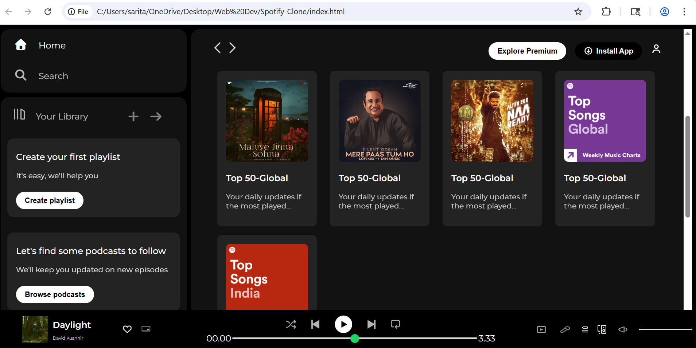

# Spotify Clone 🎵

A visually accurate, responsive web player interface built with **Pure HTML and CSS**. This project replicates the modern, dark-themed UI of Spotify, focusing on complex layouts and interactive components.

## 🚀 Live Demo
[View the Spotify Clone Live](https://techxkirti.github.io/Spotify-Clone/)

## ✨ Features
- **Authentic Spotify UI:** Replicated the iconic dark theme using a precise color palette.
- **Sticky Music Player:** A persistent bottom playback bar with custom-styled progress sliders.
- **Dynamic Grid Layout:** Responsive "Music Cards" organized by categories using Flexbox.
- **Custom Scrollbars:** Styled scroll containers for a seamless "Desktop App" feel.
- **Interactive States:** Hover effects on cards, icons, and buttons for an engaging user experience.

## 🛠️ Tech Stack
- **HTML5:** Semantic structure for sidebar, main content, and player.
- **CSS3:** Advanced Flexbox, fixed positioning, and custom range input styling.
- **Google Fonts:** 'Montserrat' for that signature Spotify typography.
- **FontAwesome:** For high-quality navigation and playback icons.

## 📸 Preview


## 💡 What I Learned
Through this project, I deepened my understanding of:
1. **Layout Architecture:** Managing three distinct fixed/scrollable sections (`sidebar`, `main-content`, `music-player`) simultaneously.
2. **Custom Form Elements:** Styling the `<input type="range">` to create a custom-branded progress bar.
3. **Z-Indexing & Sticky Nav:** Implementing a `sticky` header that stays at the top of the scrollable content area.

## 🏗️ How to Run
1. Clone the repository:
   ```bash
   git clone https://github.com/techxkirti/Spotify-Clone.git
2. Open index.html in your favorite browser.